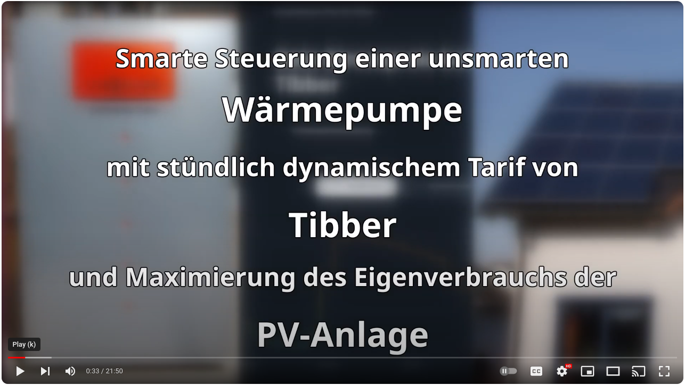
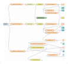

# Kostenoptimierte Steuerung einer Wärmepumpe mit dynamischen Strompreisen durch Node-RED
## Ziel
Steuerung einer Wärmepumpe zur Erzielung **geringstmöglicher Stromkosten** durch Nutzung eines  **dynamischen Strom-Tarifs mit stündlichen Preisen**. Optional kann dabei die Ertragsprognose einer vorhandenen **PV-Anlage** berücksichtigt werden.

Damit stellt dieses Projekt eine allgemeinerte Version meines Ende 2024 gestarteten Projektes [node-red-contrib-heatpump-tibber-pv](https://github.com/camueller/node-red-contrib-heatpump-tibber-pv) dar, dessen Name bereits sagte, dass ausschließlich Tibber unterstützt wurde und das Vorhandensein einer PV-Anlage impliziert wurde.

Ich habe zu diesem Thema auch ein Video erstellt, welches die Zusammenhänge und die praktische Umsetzung verständlich machen sollte:

                      

## Voraussetzungen
Folgende Vorausstzungen müssen vorliegen:
- Wärmepumpe, die über EVU-Sperre gesteuert werden kann
- Strom-Tarif mit stündlichen Preisen durch einen Anbieter mit unterstützter API 
- Raspberry Pi (mit Anpassungen auch  Server oder NAS) auf dem [Node-RED](https://nodered.org/) mit Node.js-Version >= 20 läuft

## Funktionsweise
### Überblick
Wenn eine Wärmepumpe (insbesondere solche mit großem Pufferspeicher) nur eine feste, **maximale Anzahl von Stunden täglich** (bei mit 8 Stunden) einschalten darf, ist es sinnvoll, dafür die **Stunden mit den geringstmöglichen Stromkosten** zu wählen.

Dazu müssen die **Stromkosten für jede Stunde eines Tages berechnet** werden wie folgt:

Von der **Leistungsaufnahme der Wärmepumpe** wird zunächst die **prognostizierte Leistung der PV-Anlage** abgezogen, falls eine solche vorhanden ist. Die Energie für diese **verbleibende Leistungsaufnahme** (falls positiv) muss gekauft werden und wird mit dem **zu dieser Stunde gültigen Preis** bewertet. Bei vorhandener PV-Anlage muss zu diesen Kosten allerdings noch der **Verzicht auf die Einspeisevergütung** für die **prognostizierte Leistung der PV-Anlage** addiert werden, damit die Kosten von Stunden mit PV-Leistung und solchen ohne PV-Leistung vergleichbar sind.

Entsprechend der gewünschten **maximalen Anzahl von täglichen Betriebsstunden der Wärmepumpe** werden die **Stunden mit den geringsten Stromkosten gewählt**. Es lassen sich **optional Pflichtstunden** (auch mit Wochentagbezug) definieren, die unabhängig von den Stromkosten gewählt werden.

**Zu Beginn jeder Stunde** wird geprüft, ob diese Stunde als kostengünstig klassifiziert wurde. Dementsprechend wird das **Signal zum Ein- oder Ausschalten** an die Wärmepumpe gesendet.

### Wärmepumpe
Normalerweise dient die **EVU-Sperre** dazu, dass der Energieversorger die Wärmepumpe zu Spitzenlastzeiten (in der Regel maximal 3x täglich für 2 Stunden) abschalten kann. Dazu ist in der Wärmepumpe ein Relais verbaut, dessen Kontakte geöffnet werden, wenn die Wärempumpe nicht laufen soll.

Bei der **Steuerung durch Node-RED** darf dieses Relais natürlich nicht mehr mit dem Rundsteuerempfänger des Energieversogers verbunden sein. Stattdessen wird der Leiter dieses Relais durch ein **zusätzliches Solid-State-Relais** geschaltet. Das Solid-State-Relais wiederum wird mit einem GPIO-Pin des Raspberry Pi verbunden und durch Node-RED gesteuert. Wenn das Solid-State-Relais aus ist, ist auch das EVU-Sperre-Relais der Wärmepumpe aus und die EVU-Sperre ist aktiv.

Die **grundsätzliche Idee dieser Steuerung** besteht darin, die EVU-Sperre immer aktiv zu haben außer in den Stunden, die als kostengünstig klassifiziert wurden. Damit die Wärmepumpe läuft, wenn die EVU-Sperre nicht aktiv ist, müssen die Schaltzeiten in der Wärmepumpensteuerung so angepasst werden, dass sie 24 Stunden täglich einschalten würde.

## Dynamischer Strom-Tarif mit stündlichen Preisen
Für die Berechnung der stündlichen Stromkosten der Wärmepumpe müssen die stündlichen Strompreise des Stromanbieters täglich geladen werden. Weil jeder Stromanbieter sein eigenes Datenformat  (API) verwendet sind jeweils einige Anpassungen erforderlich.

Aktuell werden folgenden Strom-Anbieter unterstützt:
- [Tibber](https://tibber.com/)
- [Awattar](https://www.awattar.at/)

## Prognose der Leistung der PV-Anlage
Falls eine PV-Anlage vorhanden ist, sind Ertragsprognosen für die Berechnung der stündlichen Stromkosten der Wärmepumpe erforderlich. Auch hier gilt, dass jeder Anbieter solcher Prognosen sein eigenes Datenformat (API) verwendet und deshalb jeweils einige Anpassungen erforderlich sind.

### [Forecast.Solar](https://forecast.solar/)
Bei Forecast.Solar muss man keinen Account erstellen. Die Angaben zur  Lage, Ausrichtung und Leistung der PV-Anlage müssen in der Flow-Konfiguration angegeben werden.

### [Solcast](https://solcast.com/)
Bei Solcast muss man sich einen [für Hauseigentümer mit Dachsolaranlagen kostenlosen Account](https://solcast.com/free-rooftop-solar-forecasting) anlegen, bei dem Angaben zur  Lage, Ausrichtung und Leistung der PV-Anlage gemacht werden müssen. Die für die Anlage vergebende `Resource Id` sowie der `API-Key` müssen in der Flow-Konfiguration angegeben werden.

## Flow und Dashboard 

Die oben beschriebene Funktionsweise wurde implementiert durch [diesen Flow](flow.md).

Um das Verhalten der Steuerung transparent zu machen, beinhaltet der Flow auch die [Visualisierung der Daten in einem Dashboard](dashboard.md).

## Installation und Konfiguration

Zur Nutzung des Flows inst die [Installation von Node-RED und einigen Bibliotheken erforderlich](installation.md).

Damit der Flow tatsächlich funktioniert ist die [Konfiguration einiger Werte](configuration.md) erforderlich.

## Unterstützung

Diskussionen und Fragen rund um den *Smart Appliance Enabler* sind in [Github Diskussion](https://github.com/camueller/node-red-contrib-heatpump-dynamic-tariff/discussions) richtig platziert.

Darüber hinaus biete ich einen [persönlichen, individuellen, kostenpflichtigen Support mit Beratung](Support.md) an - quasi das "Rundum-sorglos Paket".

## Spenden

Ich würde es als Anerkennung meiner Arbeit betrachten, wenn ein Teil der von Ihnen durch dieses Projekt gesparten Stromkosten als Spende dafür verwendet werden würde. Das geht ganz einfach per [Paypal](https://paypal.me/CarlAxelMueller).
