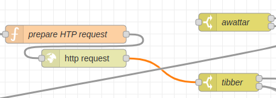
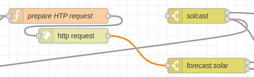

# Konfiguration
Die Konfiguration besteht aus kleinen Anpassungen im Flow-Editor sowie Umgebungsvariablen, die konfiguriert werden via `Menü -> Flow -> Bearbeiten -> Schaltfläche "Umgebungsvariablen" (unterhalb der "Fertig"-Schaltfläche)`:

## Stromanbieter
Im Flow muss der verwendete Stromanbieter konfiguriert werden, indem der Node für den Stromanbieter mit dem links davon befindlichen `http request` Node verbunden wird. Für Tibber würde das so aussehen (orange-farbene Linie): 

Der `http request` darf nur mit **einem** Stromanbieter-Node verbunden werden.

Die Umgebungsvariablen sind spezifisch für den jeweiligen Stromanbieter:

### Tibber

| Variable                    | Wert                                                                                    |
|-----------------------------|-----------------------------------------------------------------------------------------|
| energyPriceApiUrl           | https://api.tibber.com/v1-beta/gql                                                      |
| energyPriceApiMethod        | POST                                                                                    |
| energyPriceApiContentType   | application/json                                                                        |
| energyPriceApiAuthorization | Bearer "tibber autorization token ohne anführungszeichen"                               |
| energyPriceApiPayload       | {"query":"{viewer {homes {currentSubscription {priceInfo {today {total startsAt}}}}}}"} |
 
### Awattar

| Variable                  | Wert                                 |
|---------------------------|--------------------------------------|
| energyPriceApiUrl         | https://api.awattar.at/v1/marketdata |

## Anbieter für PV-Prognosen

Im Flow muss der verwendete Anbieter von PV-Prognosen konfiguriert werden, indem der Node für den PV-Prognosen-Anbieter mit dem links davon befindlichen `http request` Node verbunden wird. Für Forecast.Solar würde das so aussehen (orange-farbene Linie):

Der `http request` darf nur mit **einem** PV-Prognosen-Anbieter-Node verbunden werden.

Die Umgebungsvariablen sind spezifisch für den jeweiligen PV-Prognosen-Anbieter:

### Forecast.Solar

| Variable         | Wert                                                               |
|------------------|--------------------------------------------------------------------|
| pvForecastApiUrl | https://api.forecast.solar/estimate/a.aaaaaaa/b.bbbbbbb/cc/dd/e.ee |

wobei the URL-Parameter folgende Bedeutung haben:

| Parameter | Beschreibung                                                                                          |
|-----------|-------------------------------------------------------------------------------------------------------|
| a.aaaaaaa | Geografische Breite, z.B. 50.2438041                                                                  |
| b.bbbbbbb | Geografische Länge, z.B. 8.9822944                                                                    |
| cc        | Dachneigung in Grad, z.B. 35                                                                          |
| dd        | Horizintale Ausrichtung (-180=Nord, -90=Ost, 0=Süd, 90=West, 180=Nord), z.B. -8 für Süd mit etwas Ost |
| ee.ee     | Kilowatt Peak, z.B. 9.36                                                                              |

### Solcast

| Variable         | Wert                                                                                                    |
|------------------|---------------------------------------------------------------------------------------------------------|
| pvForecastApiUrl | https://api.solcast.com.au/rooftop_sites/rrrr-rrrr-rrrr-rrrr/forecasts?format=json&api_key=sssssssssssssssssss |

wobei the URL-Parameter folgende Bedeutung haben:

| Parameter           | Beschreibung                                                |
|---------------------|-------------------------------------------------------------|
| rrrr-rrrr-rrrr-rrrr | die von [Solcast](https://solcast.com/) für die Anlage vergebene Resource Id |
| sssssssssssssssssss | der bei [Solcast](https://solcast.com/) generierte API key                   |

## Sonstige Umgebungsvariablen

### Pflicht-Parameter
Folgende **Pflicht-Parameter** müssen gesetzt werden:
- `estimatedPowerConsumption`: die geschätzte Leistungsaufnahme der Wärmepumpe in kW (z.B. 4.4)
- `powerConsumptionHours`: die maximale Anzahl der Stunden, in denen die Wärmepumpe täglich laufen  soll (z.B. 8)

### Optionale Parameter
Zusätzlich können folgende **optionale Parameter** gesetzt werden:
- `feedInTariff`: die Einspeisevergütung inkl. MwSt. in Euro/KWh (z.B. 0.1231)
- `mandatoryHours`: die Pflichtstunden (als Teil der maximalen Anzahl der Stunden), in denen die Wärmepumpe unabhängig vom Preis laufen soll. Der Wert muss als Array angegeben werden, wobei ein Array-Element
    - als Zahl angegeben wird für tägliche Gültigkeit (z.B. `[8]` für 8 Uhr)
    - als Array für Gültigkeit mit Wochentagbezug, wobei Sonntag=0, Montag=1, Dienstag=2, Mittwoch=3, Donnerstag=4, Freitag=5, Samstag=6
        - 2 Elemente (z.B. `["1", 4]` für Montags 4 Uhr)
            - erstes Element: konkreter Wochentag oder Wochentagsbereich
            - zweites Element: konkrete Stunde oder Stundenbereich
        - 2 Elemente mit erstem Element als Wochentagsbereich
        - 3 Elemente (z.B. `["1-5", "1-4", 2]` für Montag bis Freitag mindestens 2 Stunden zwischen 1:00 Unr und 4:59 Uhr)
            - erstes Element konkreter Wochentag oder Wochentagsbereich
            - zweites Element: Stundenbereich
            - drittes Element: Anzahhl der Stunden innerhalb des Stundenbereichs, wobei die kostengünstigsten Stunden gewählt werden
        - 4 Elemente (z.B: `["1-5", "1-6", 3, [2, 4]]` für Montag bis Freitag mindestens 3 Stunden zwischen 1:00 Unr und 6:59 Uhr, wobei die Stunden ab 2:00 Uhr und 4:00 Uhr auf jeden Fall enthalten sind)
            - erstes Element konkreter Wochentag oder Wochentagsbereich
            - zweites Element: Stundenbereich
            - drittes Element: Anzahhl der Stunden innerhalb des Stundenbereichs, wobei die kostengünstigsten Stunden gewählt werden
            - viertes Element: Pflichtstunden innerhalb des Stundenbereichs
- `distributeHours`: zur Vermeidung von extrem langen Ausschaltphasen bedingt durch Einschaltzeiten in den ersten Stunden des vorangegangenen Tages und in den letzten Stunden des aktuellen Tages. Das kann zu Ausschaltzeiten von 30 Stunden und mehr führen. Durch setzen eine Wertes von `[2,18,3]` wird zum Ausdruck gebracht: Innerhalb von 18 Stunden nach der `2`-letzten Einschaltstunde des Vortages müssen 3 Einschaltstunden erfolgen.
- `fallbackHours`: falls Strome-Preise oder PV-Prognose nicht abgerufen werden können, wird die Wärmepumpe in den mit `fallbackHours` identifizierten Stunden laufen. Die Syntax des Wertes ist identisch mit `mandatoryHours`, wobei hier aber nur eine Zahl oder ein Array mit 2 Elemente angegeben werden können.
- `pvForecastFactor`: wird mit der prognostizierten PV-Leistung multipliziert als Korrekturfaktor, wenn die Prognosen regelmäßig abweichen
