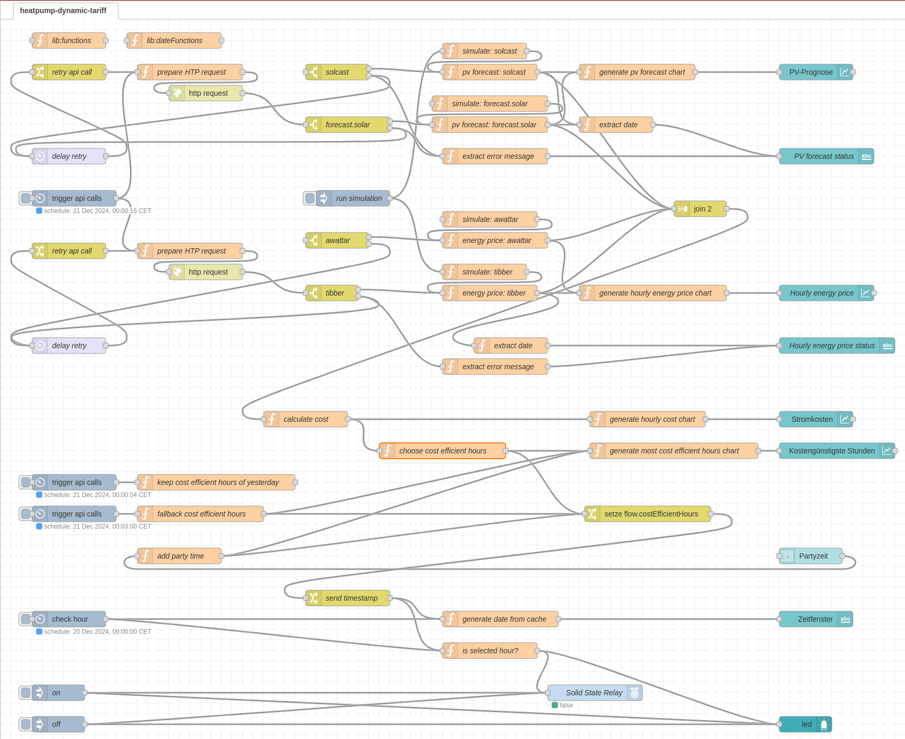
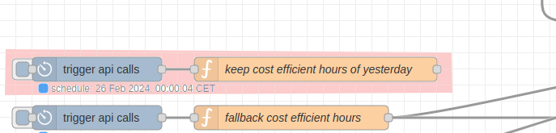
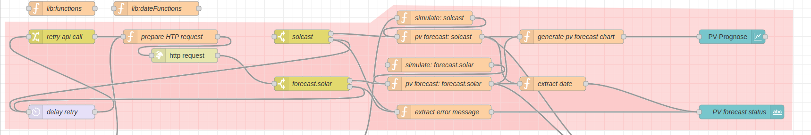
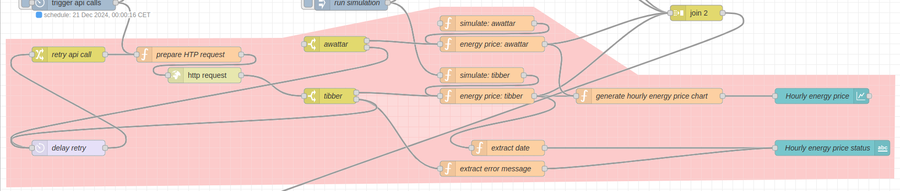
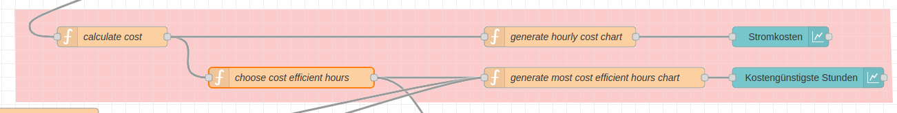
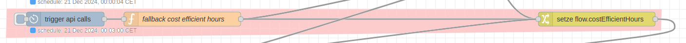
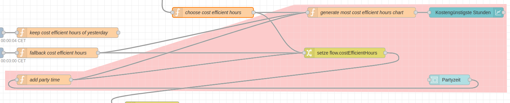
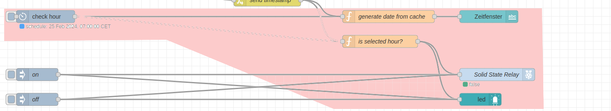

# Flow
Der folgende Abbildung des Flows repräsentiert den Inhalt der Datei [flow.json](flow.json) hier im Repository.


Der Flow besteht im wesentlichen aus sechs Teilen, wobei Teil 1 bis 4 täglich direkt nach Mittnacht ausgeführt werden:

## Teil 1
sichert die die kostengünstigsten Stunden des vorangegangenen Tages, bevor diese mit den Werten des aktuellen Tages überschrieben werden



## Teil 2
beinhaltet die Abfrage der PV-Prognose, wobei diese in eine Nachricht mit folgender Payload konvertiert werden (prognostizierte Leistung in kW):
```json
{
  "2024-12-20T00": 0,
  "2024-12-20T01": 0,
  "2024-12-20T02": 0,
  "2024-12-20T03": 0,
  "2024-12-20T04": 0,
  "2024-12-20T05": 0,
  "2024-12-20T06": 0,
  "2024-12-20T07": 0,
  "2024-12-20T08": 0,
  "2024-12-20T09": 0.194,
  "2024-12-20T10": 0.885,
  "2024-12-20T11": 1.212,
  "2024-12-20T12": 1.135,
  "2024-12-20T13": 0.926,
  "2024-12-20T14": 0.746,
  "2024-12-20T15": 0.546,
  "2024-12-20T16": 0.045,
  "2024-12-20T17": 0,
  "2024-12-20T18": 0,
  "2024-12-20T19": 0,
  "2024-12-20T20": 0,
  "2024-12-20T21": 0,
  "2024-12-20T22": 0,
  "2024-12-20T23": 0
}
```


## Teil 3
beinhaltet die Abfrage der Strompreise, wobei diese in eine Nachricht mit folgender Payload konvertiert werden (Preise in Euro/kWh):
```json
{
  "2024-06-16T00": 0.2152,
  "2024-06-16T01": 0.1979,
  "2024-06-16T02": 0.1914,
  "2024-06-16T03": 0.189,
  "2024-06-16T04": 0.1881,
  "2024-06-16T05": 0.1885,
  "2024-06-16T06": 0.189,
  "2024-06-16T07": 0.1864,
  "2024-06-16T08": 0.1855,
  "2024-06-16T09": 0.184,
  "2024-06-16T10": 0.1736,
  "2024-06-16T11": 0.1697,
  "2024-06-16T12": 0.1617,
  "2024-06-16T13": 0.1498,
  "2024-06-16T14": 0.1431,
  "2024-06-16T15": 0.151,
  "2024-06-16T16": 0.1735,
  "2024-06-16T17": 0.1827,
  "2024-06-16T18": 0.2524,
  "2024-06-16T19": 0.3041,
  "2024-06-16T20": 0.3273,
  "2024-06-16T21": 0.3334,
  "2024-06-16T22": 0.3287,
  "2024-06-16T23": 0.2979
}
```



## Teil 4
berechnet aus diesen Daten die stündlichen Kosten für den Betrieb der Wärmepumpe und bestimmt die kostengünstigsten Stunden



## Teil 5
setzt Standard-Werte für die kostengünstigsten Stunden, für den Fall, dass die Abfrage der PV-Prognose und/oder die Abfrage der Strompreise nicht erfolgreich sind



## Teil 6
erlaubt das Hinzufügen eines Stundenbereichs zu den bereits als kostengünstig klassifizierten Stunden. Das entspricht der Partyzeit-Funktion bei vielen Heizungssteuerungen.



## Teil 7
führt zu jeder vollen Stunde die Prüfung durch, ob die aktuelle Stunde als kostengünstig klassifiziert ist und aktualisiert den Schaltzustand des Solid-State-Relays


